# Blinko — 会表达情绪的桌面机器人

---

## 项目背景

在人与机器的互动中，**情绪表达**是建立连接的关键。但大多数桌面设备都是冷冰冰的——它们能计算，能提醒，却不能像一个活物那样用表情和肢体语言回应你。

Blinko 是一个探索**物理计算 × 情感交互**的设计实验。我们希望在一个小小的桌面机器人身上，让数字表情和机械运动协同工作，创造出一种"它好像真的在看我"的感受。

---

## 作品展示

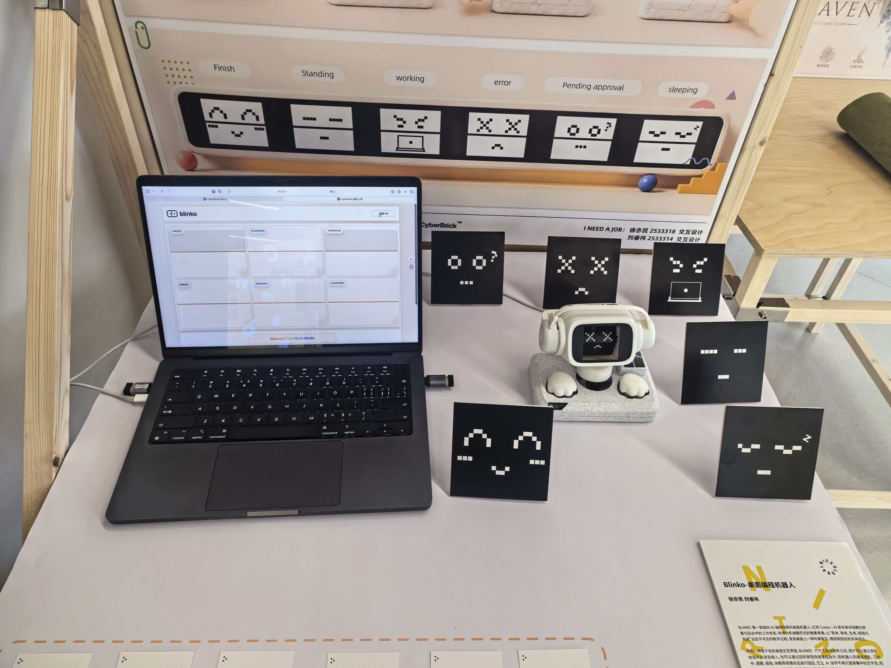

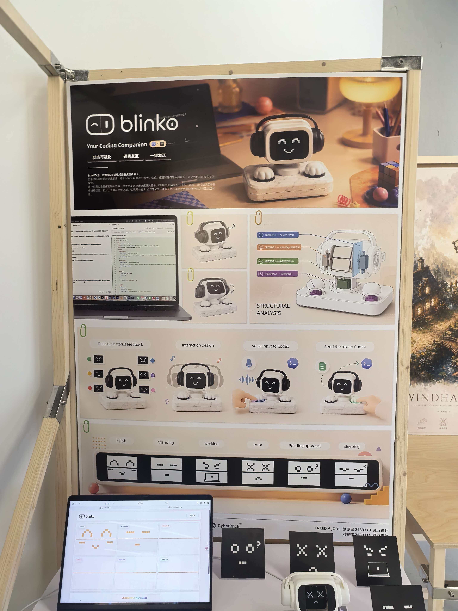

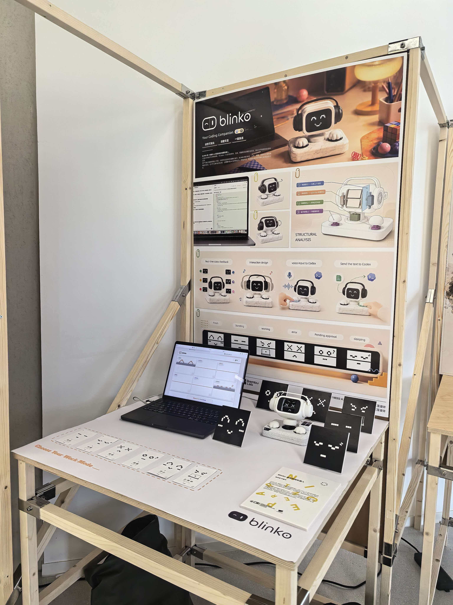

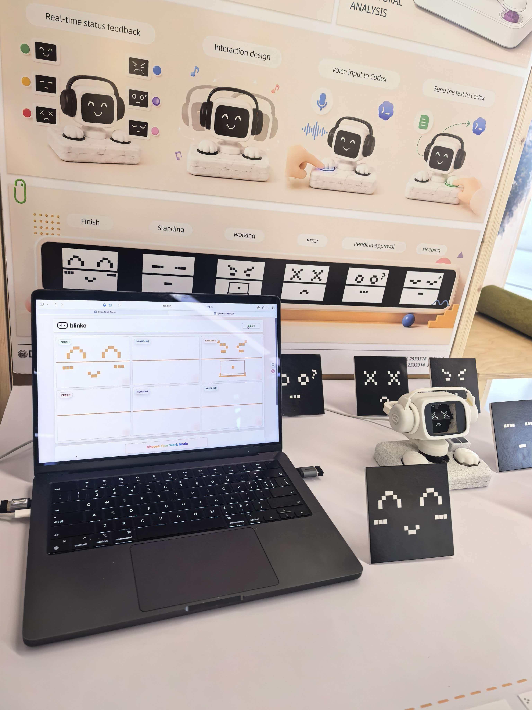

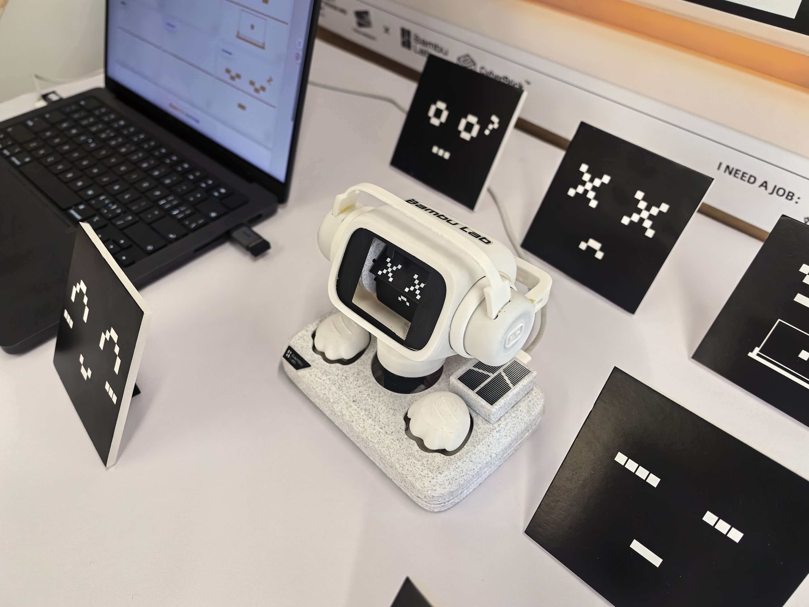

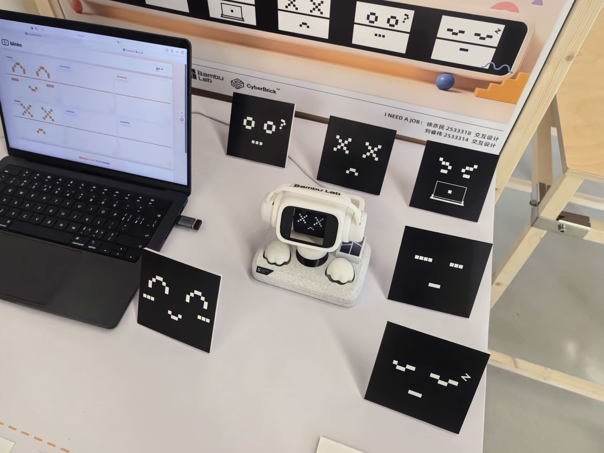

---

## 它是怎么工作的

### 联动逻辑

```
┌─────────────────────────────────────────────────────┐
│                   软件层（Python）                     │
│  cyberbrick-display/server.py                       │
│  浏览器打开展示页面 → 选择 Work Mode → 随机上传程序      │
│                                                     │
│  cyberbrick-debug/server.py                         │
│  浏览器打开代码面板 → 在线编写/运行 MicroPython 代码      │
└──────────────────────┬──────────────────────────────┘
                       │  USB 串口 (mpremote)
                       ▼
┌─────────────────────────────────────────────────────┐
│                 硬件层（Cyberbrick）                   │
│  LED 矩阵 × 2  →  6 种表情动画（GIF → LED 像素映射）    │
│  舵机 × N      →  摇头 / 点头 / 旋转                   │
│  扬声器         →  声音反馈                            │
└──────────────────────┬──────────────────────────────┘
                       │
                       ▼
┌─────────────────────────────────────────────────────┐
│              物理层（3D 打印外壳）                      │
│  表情转换板  →  遮挡/露出 LED 来切换表情                │
│  连接部件    →  驱动头部多轴旋转                        │
│  底座        →  稳定重心 + 走线隐藏                     │
└─────────────────────────────────────────────────────┘
```

### 6 种情绪状态

| 状态 | 说明 |
|------|------|
| **FINISH** | 任务完成，开心 |
| **STANDING** | 待机中，等待指令 |
| **WORKING** | 工作中，专注 |
| **ERROR** | 出错了，困惑 |
| **PENDING** | 思考中，加载 |
| **SLEEPING** | 休眠，安静 |

每种状态对应一组 **GIF 动画 + 物理动作**的组合。比如 SLEEPING 下 LED 显示闭眼动画，舵机缓慢低头；WORKING 下则快速旋转 + 眨眼。

### 随机模式（Work Mode）

点击 "Choose Your Work Mode" 后，系统按权重随机选择一个行为程序上传到 Cyberbrick：

- **fin.py**（0.3）— 收尾动作序列
- **swing2.py**（0.5）— 摇摆晃动
- **noding.py**（0.2）— 点头动作

随机性让 Blinko 的行为不那么可预测，更有生命感。

---

## 制作过程

### CAD 建模


外壳结构在 CAD 中完成设计，包括外壳、底座、耳机、表情转换板、遮挡板和连接部件。

### 切片

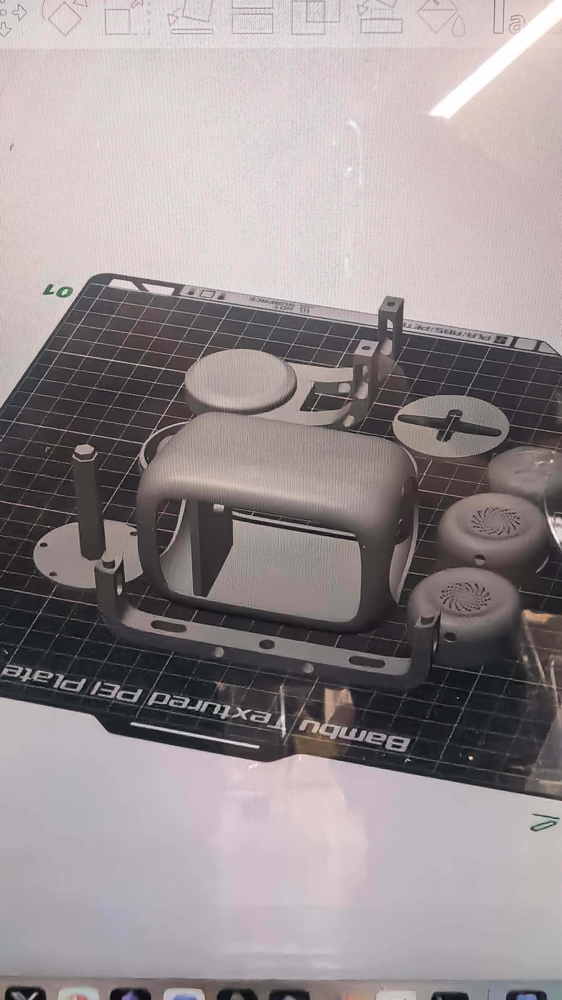

将 STL 模型导入切片软件，生成 FDM 打印路径。

### 3D 打印

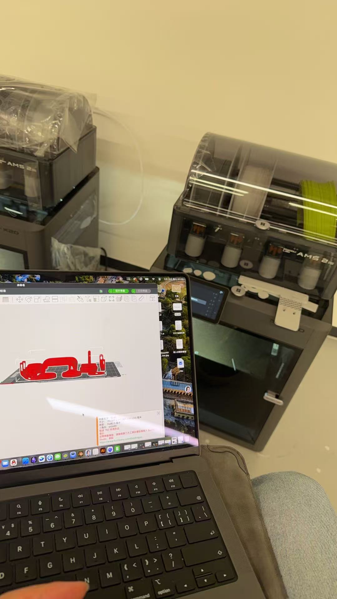

所有外壳部件通过 FDM 3D 打印完成，层厚 0.2mm，PLA 材料。

### 结构测试

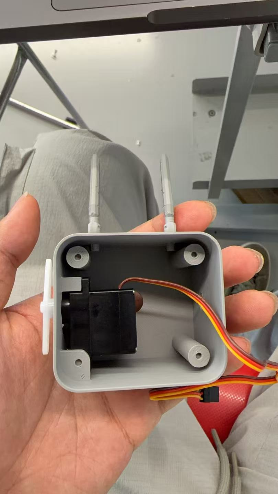

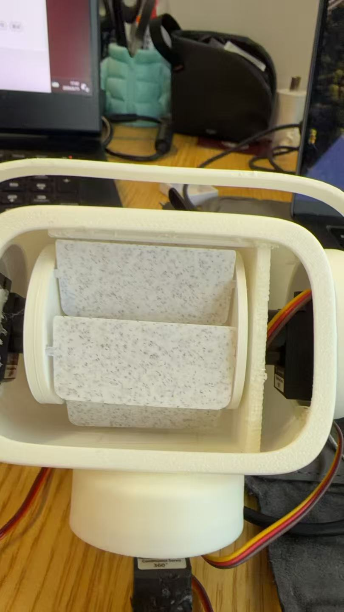

打印完成后进行结构组装测试，确保各部件配合精度。

### 旋转机构

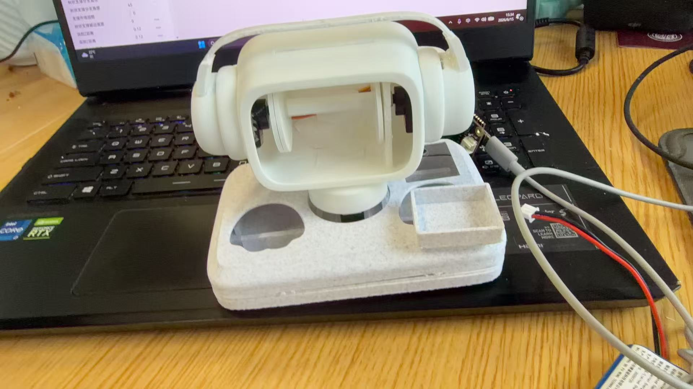

舵机驱动旋转机构，测试表情转换板的遮挡效果。

### 电路接线

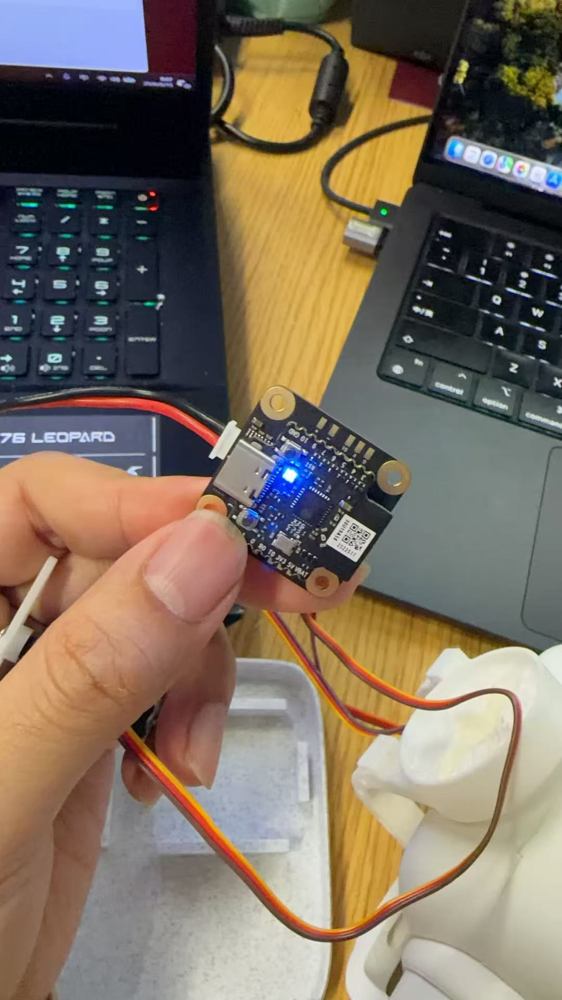

Cyberbrick 主板与 LED 矩阵、舵机、扬声器的线路连接。

### 组装

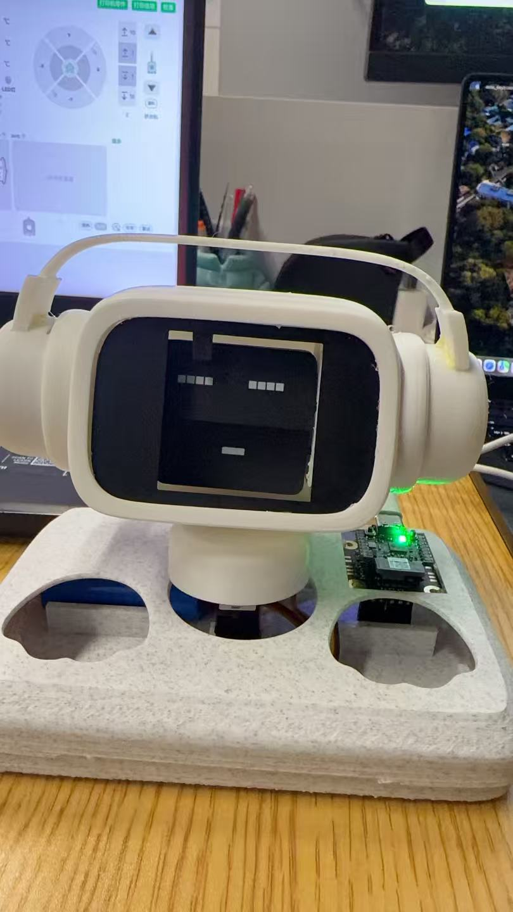

将电子元件嵌入 3D 打印外壳，完成整机组装。

---

## 技术栈

| 层 | 技术 |
|----|------|
| 后端服务 | Python 3.11+ · HTTP Server |
| 硬件通信 | mpremote · USB Serial (REPL) |
| 硬件平台 | Cyberbrick (MicroPython) |
| 前端界面 | 原生 HTML/CSS/JS（零依赖） |
| 3D 建模 | STL · 3MF（FDM 打印） |

---

## 快速开始

### 调试控制器

```bash
cd cyberbrick-debug
./start.command
# 浏览器打开 http://127.0.0.1:8768
```

在线编辑 MicroPython 代码，直接向 Cyberbrick 发送指令。

### 展示页面

```bash
cd cyberbrick-display
./start.command
# 浏览器打开 http://127.0.0.1:8767
```

6 张表情卡片 + 随机模式上传，适合展览互动。

---

## 项目结构

```
├── cyberbrick-debug/     # 调试工具 —— 代码编辑面板
│   ├── server.py         # 本地 Web 服务
│   ├── start.command     # macOS 双击启动
│   └── src/
│       └── cyberbrick_led.py  # LED 控制 API
│
├── cyberbrick-display/   # 展示工具 —— 表情 + 上传
│   ├── server.py         # 本地 Web 服务
│   ├── start.command     # macOS 双击启动
│   ├── assets/           # 6 组表情 GIF/PNG
│   ├── py/               # 随机行为程序
│   └── files/            # 可上传示例
│
└── docs/images/          # 项目照片
```
